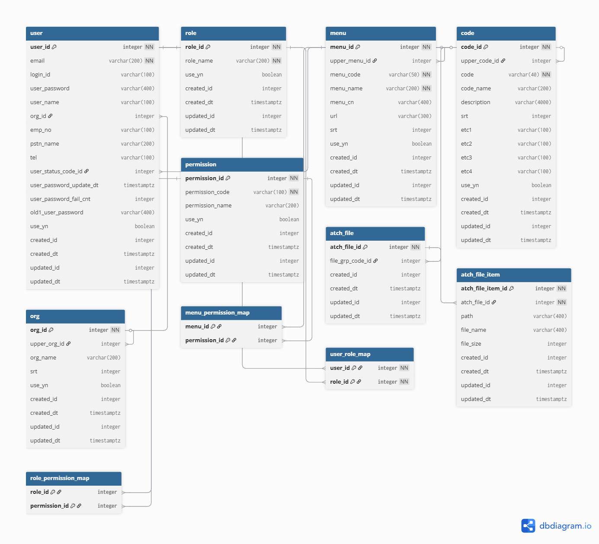

# 📑 Database Schema (PostgreSQL)

아래는 공통 테이블 기반 설계 (User, Role, Menu, Code, Org, Permission, File 등)입니다.  
ERD는 [dbdiagram.io](https://dbdiagram.io) 기반으로 작성되었고, PostgreSQL 환경을 기준으로 합니다.  


---

## 🗄️ DBML

```dbml
// Use DBML to define your database structure
// Docs: https://dbml.dbdiagram.io/docs

Table user [note: '사용자 계정 관리 테이블'] {
  user_id integer [pk, increment, not null, note: '사용자 PK']
  email varchar(200) [unique, not null, note: '이메일 (로그인 계정)']
  login_id varchar(100) [note: '로그인 ID']
  user_password varchar(400) [note: '비밀번호 (암호화 저장)']
  user_name varchar(100) [note: '사용자 이름']
  org_id integer [ref: > org.org_id, note: '소속 조직 ID']
  emp_no varchar(100) [note: '사번']
  pstn_name varchar(200) [note: '직위명']
  tel varchar(100) [note: '전화번호']
  user_status_code_id integer [ref: > code.code_id, note: '사용자 상태 코드 (공통코드 참조)']
  user_password_update_dt timestamptz [note: '비밀번호 변경일시']
  user_password_fail_cnt integer [note: '비밀번호 실패 횟수']
  old1_user_password varchar(400) [note: '이전 비밀번호']
  use_yn boolean [default: true, note: '사용 여부']
  created_id integer [note: '생성자 ID']
  created_dt timestamptz [default: `now()`, note: '생성일시']
  updated_id integer [note: '수정자 ID']
  updated_dt timestamptz [default: `now()`, note: '수정일시']
}

Table role [note: '사용자 역할(권한 그룹) 테이블'] {
  role_id integer [pk, increment, not null, note: '역할 PK']
  role_name varchar(200) [unique, not null, note: '역할명 (예: 관리자, 사용자)']
  use_yn boolean [default: true, note: '사용 여부']
  created_id integer [note: '생성자 ID']
  created_dt timestamptz [default: `now()`, note: '생성일시']
  updated_id integer [note: '수정자 ID']
  updated_dt timestamptz [default: `now()`, note: '수정일시']
}

Table menu [note: '시스템 메뉴 관리 테이블'] {
  menu_id integer [pk, increment, not null, note: '메뉴 PK']
  menu_code varchar(50) [unique, not null, note: '메뉴 코드 (논리 식별자)']
  upper_menu_id integer [ref: > menu.menu_id, note: '상위 메뉴 ID']
  menu_name varchar(200) [not null, note: '메뉴명']
  menu_cn varchar(400) [note: '메뉴 설명']
  url varchar(300) [note: '메뉴 URL']
  srt integer [note: '정렬 순서']
  use_yn boolean [default: true, note: '사용 여부']
  created_id integer [note: '생성자 ID']
  created_dt timestamptz [default: `now()`, note: '생성일시']
  updated_id integer [note: '수정자 ID']
  updated_dt timestamptz [default: `now()`, note: '수정일시']
}

Table code [note: '공통 코드 관리 테이블'] {
  code_id integer [pk, increment, not null, note: '코드 PK (Surrogate Key)']
  upper_code_id integer [ref: > code.code_id, note: '상위 코드 ID']
  code varchar(40) [unique, not null, note: '코드 값 (논리 식별자)']
  code_name varchar(200) [note: '코드명']
  description varchar(4000) [note: '코드 설명']
  srt integer [note: '정렬 순서']
  etc1 varchar(100) [note: '예비 컬럼1']
  etc2 varchar(100) [note: '예비 컬럼2']
  etc3 varchar(100) [note: '예비 컬럼3']
  etc4 varchar(100) [note: '예비 컬럼4']
  use_yn boolean [default: true, note: '사용 여부']
  created_id integer [note: '생성자 ID']
  created_dt timestamptz [default: `now()`, note: '생성일시']
  updated_id integer [note: '수정자 ID']
  updated_dt timestamptz [default: `now()`, note: '수정일시']

  indexes {
    (upper_code_id, code) [unique]
  }
}

Table org [note: '조직 관리 테이블'] {
  org_id integer [not null, increment, pk, note: '조직 PK']
  upper_org_id integer [ref: > org.org_id, note: '상위 조직 ID']
  org_name varchar(200) [note: '조직명']
  srt integer [note: '정렬 순서']
  use_yn boolean [default: true, note: '사용 여부']
  created_id integer [note: '생성자 ID']
  created_dt timestamptz [default: `now()`, note: '생성일시']
  updated_id integer [note: '수정자 ID']
  updated_dt timestamptz [default: `now()`, note: '수정일시']
}

Table permission [note: '권한 정의 테이블 (CRUD 등)'] {
  permission_id integer [pk, not null, note: '권한 PK']
  permission_code varchar(100) [unique, not null, note: '권한 코드 (예: USER_READ)']
  permission_name varchar(200) [note: '권한명 (설명)']
  use_yn boolean [default: true, note: '사용 여부']
  created_id integer [note: '생성자 ID']
  created_dt timestamptz [default: `now()`, note: '생성일시']
  updated_id integer [note: '수정자 ID']
  updated_dt timestamptz [default: `now()`, note: '수정일시']
}

Table atch_file [note: '첨부파일 묶음 테이블'] {
  atch_file_id integer [pk, increment, not null, note: '첨부파일 PK']
  file_grp_code_id integer [ref: > code.code_id, note: '파일 그룹 코드 (공통코드 참조)']
  created_id integer [note: '생성자 ID']
  created_dt timestamptz [default: `now()`, note: '생성일시']
  updated_id integer [note: '수정자 ID']
  updated_dt timestamptz [default: `now()`, note: '수정일시']
}

Table atch_file_item [note: '첨부파일 개별 항목 테이블'] {
  atch_file_item_id integer [pk, increment, not null, note: '첨부파일 항목 PK']
  atch_file_id integer [not null, ref: > atch_file.atch_file_id, note: '첨부파일 PK 참조']
  path varchar(400) [note: '파일 저장 경로']
  file_name varchar(400) [note: '원본 파일명']
  file_size integer [note: '파일 크기 (byte)']
  created_id integer [note: '생성자 ID']
  created_dt timestamptz [default: `now()`, note: '생성일시']
  updated_id integer [note: '수정자 ID']
  updated_dt timestamptz [default: `now()`, note: '수정일시']
}

Table role_permission_map [note: '역할-권한 매핑 테이블'] {
  role_id integer [ref: > role.role_id, note: '역할 PK']
  permission_id integer [ref: > permission.permission_id, note: '권한 PK']
  indexes { (role_id, permission_id) [pk] }
}

Table menu_permission_map [note: '메뉴-권한 매핑 테이블'] {
  menu_id integer [ref: > menu.menu_id, note: '메뉴 PK']
  permission_id integer [ref: > permission.permission_id, note: '권한 PK']
  indexes { (menu_id, permission_id) [pk] }
}

Table user_role_map [note: '사용자-역할 매핑 테이블'] {
  user_id integer [not null, ref: > user.user_id, note: '사용자 PK']
  role_id integer [not null, ref: > role.role_id, note: '역할 PK']

  indexes {
    (user_id, role_id) [pk]
  }
}

...

